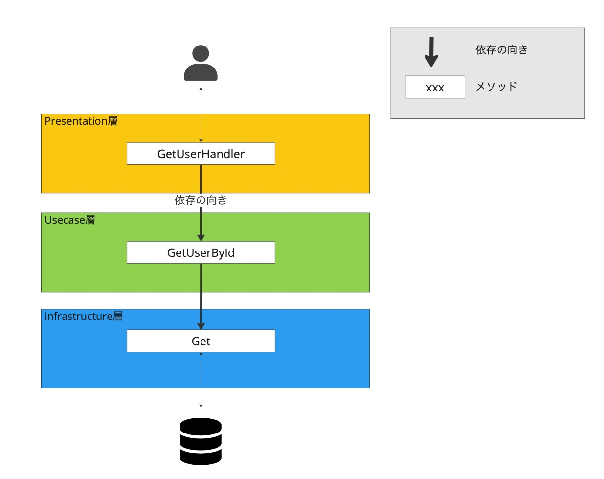
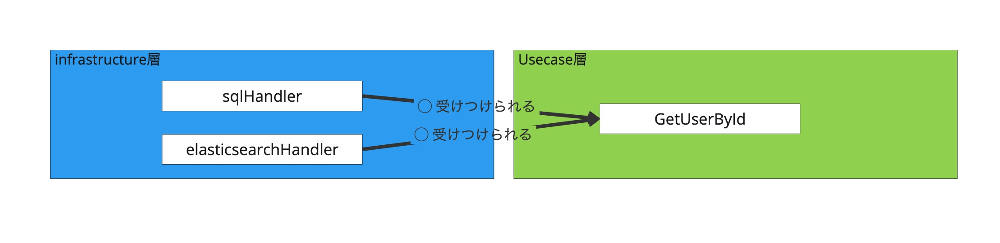
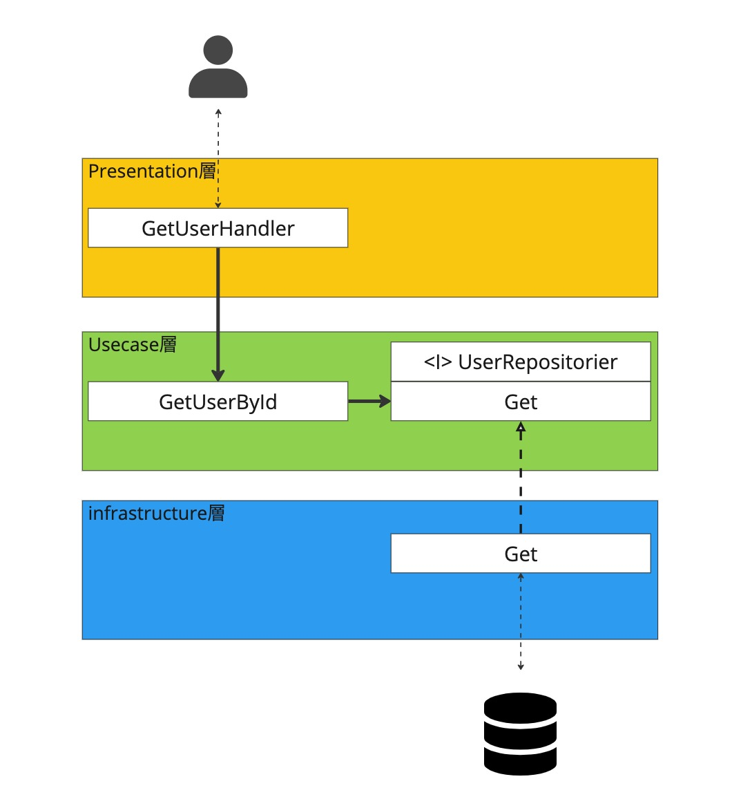

# レイヤードアーキテクチャから学ぶ密結合と疎結合
## 目次
  - 本記事でやること
  - 対象読者
  - 使用言語
  - 背景
  - レイヤードアーキテクチャの紹介
  - レイヤードアーキテクチャにおける密結合なコードの紹介
  - 密結合だと何が問題なのか
  - 疎結合なコードに変更する
  - 疎結合にすると何が良いのか
  - おまけ
    - 依存性逆転の原則
  - まとめ

## 本記事でやること
- レイヤードアーキテクチャを題材として密結合なコードを紹介
- 密結合だとどういう問題があるのかを紹介
- 疎結合なコードに変更
- 疎結合にするとどういうメリットがあるのかを紹介

今回実装したコードはこちらのレポジトリで公開しております。

## 対象読者
- 「密結合」・「疎結合」というワードは知っているが、実際にどういう状態を指すのかを知りたい方
- 「密結合」だとどういう問題があるのかを知りたい方
- 「疎結合」だとどういうメリットがあるのかを知りたい方

## 使用言語
- Go 1.21.0

## 背景
システム設計やソースコードなど含め、「疎結合」に保つことが重要というのはよく耳にすると思います。
筆者の過去の経験ですが、インターネットで密結合や疎結合について調べてみても、「密結合」と「疎結合」を現実のモノに例えて説明している記事が多く、腑に落ちないことがありました。
そこで、より実務に沿った内容で密結合と疎結合について考えることができないかと考え、レイヤードアーキテクチャを題材に密結合と疎結合について考えてみました。

## レイヤードアーキテクチャの紹介
レイヤードアーキテクチャは、アプリケーションが持つ責務をいくつかの層に分け、各層の依存の向きを一方向に制御する、設計パターンの1つです。
この他にも、クリーンアーキテクチャやオニオンアーキテクチャなどがありますが、各設計パターンの目的はアプリケーションの責務を定義し、依存の向きを明確にすることで共通していると思っています。

### 今回想定するアプリケーションと各層の定義
今回は、レイヤードアーキテクチャを題材に密結合と疎結合について考えていきます。 簡略化のため、以下の3層のみを考えます。
レイヤードアーキテクチャは、Presentation層からInfrastructure(以下Infra)層に向かって上から下に依存の向きが一方向になるように設計されます。

また、想定するアプリケーションは入力されたユーザーIDを元にデータベースからユーザー名を取得するというものとします。
以下に、各層の責務と各層で定義しているメソッド名も合わせて記載します。

| 層 | 責務                     | メソッド           |
| --- |------------------------|----------------|
| Presentation | ユーザーからの入力を受け取り、Usecase層に渡す | GetUserHandler |
| Usecase | ユーザーからの入力を元にユーザー名を取得する | GetUserById    |
| Infrastructure | データベースからユーザー名を取得する     | Get            |





## レイヤードアーキテクチャにおける密結合なコード
ソフトウェアにおける密結合な状態とは、「**あるモジュールが他のモジュールに強く依存しており、どちらかを変更するともう一方も変更する必要がある状態**」のことを指します。

以下のUsecase層(GetUserByIdメソッド)とInfra層(Getメソッド)のコードを見ると、GetUserByIdメソッドの中でGetメソッドを呼んでおり、さらにGetUserByIdメソッドが受け取ったdb引数をそのままGetメソッドに渡しています。

つまり、この状態は**GetUserByIdメソッドがGetメソッドに強く依存している状態**と言えます。


```golang:Usecase層
type UserDTO struct {
	Id   int
	Name string
}

func GetUserById(ctx context.Context, userId int, db *sql.DB) (UserDTO, error) {
	user, err := infra.Get(ctx, userId, db)
	if err != nil {
		// error handling
	}
	return UserDTO{
		Id:   user.Id,
		Name: user.Name,
	}, nil
}
```

```golang:Infra層
type User struct {
	Id   int
	Name string
}

func Get(ctx context.Context, userId int, db *sql.DB) (User, error) {
	u := User{}

	err := db.QueryRowContext(ctx, "SELECT * FROM users WHERE id = ?", userId).Scan(&u.Id, &u.Name)
	if err != nil {
		// error handling
	}
	return u, nil
}

```

次に「**どちらかを変更するともう一方も変更する必要がある状態**」について紹介します。
例えば、Infra層がアクセスするデータベースがElasticsearchに変わった場合を考えます。


```diff:Infra層
- func Get(ctx context.Context, userId int, db *sql.DB) (User, error) {
+ func Get(ctx context.Context, userId int, db *elasticsearch.Client) (User, error) {
	u := User{}
 
-	err := db.QueryRowContext(ctx, "SELECT * FROM users WHERE id = ?", userId).Scan(&u.Id, &u.Name)
- 	if err != nil {
- 	// error handling
-   }
+   // Get user from elasticsearch
	return u, nil
}
```
Usecase層の`GetUserById`メソッドの`db`引数の型(`sql.DB`)やメソッド内で呼んでいる`Get`メソッドの`db`引数の型(`sql.DB`)を変更する必要が出てきます。
```diff:Usecase層
- func GetUserById(ctx context.Context, userId int, db *sql.DB) (UserDTO, error) {
+ func GetUserById(ctx context.Context, userId int, db *elasticsearch.Client) (UserDTO, error) {
	user, err := infra.Get(ctx, userId, db)
	if err != nil {
		// error handling
	}
	return UserDTO{
		Id:   user.Id,
		Name: user.Name,
	}, nil
}
```

これらの状態から`GetUserById`メソッドと`Get`メソッドが密結合な状態になっていると言えます。

## 密結合だと何が問題なのか

`GetUserById`メソッドと`Get`メソッドが密結合による問題点を以下にまとめます。

### 1. 変更に弱いコードになってしまう
前章でも触れましたが、Infra層の変更(接続するデータベースが変わった場合)にUsecase層も変更する必要が出てきてしまう。

### 2. テストがしにくいコードになってしまう
`Get`メソッドの具象に依存していることで、Usecase層の単体テスト時に`Get`メソッドをmockすることができず都度データベースに接続する必要があり、テストの実行が遅くなってしまうデメリットが発生します。

また、データベースに接続するということは、テストの度にデータベースの状態を初期化または必要なデータを用意する必要が出てきます。

### 3. 実装の順序が決まってしまう
`Get`メソッドの具象に依存していることで、`Get`メソッドを実装するまでUsecase層のメソッドを実装することができなくなります。


## 疎結合なコードに変更する
疎結合とは、**モジュール間の結合度が低いこと**を指します。今回の場合、Usecase層とInfra層の依存関係を極力小さくし、各層が定義する関心事に集中できるようにします。


疎結合なコードに変更するために以下2点を実施します。

### 1. 抽象に依存する
Go言語における"抽象"はインターフェイスを指すため、今回はインターフェイスが持つメソッドのシグネチャに依存するようにします。


### 2. Dependency Injectionを行う
モジュール間の結合を低くするために、外部から依存するコンポーネント(今回はインターフェース)を注入します。


```diff:Usecase層
type UserDTO struct {
	Id   int
	Name string
}

+ type UserRepositorier interface {
+	Get(ctx context.Context, userId int) (infra.User, error)
+ }

- func GetUserById(ctx context.Context, userId int, db *sql.DB) (UserDTO, error) {
+ func GetUserById(ctx context.Context, userId int, repo UserRepositorier) (UserDTO, error) {

-   user, err := infra.Get(ctx, userId, db)
+	user, err := repo.Get(ctx, userId)
	if err != nil {
		// error handling
	}

	return UserDTO{
		Id:   user.Id,
		Name: user.Name,
	}, nil
}

```


```diff:Infra層
```

## 疎結合にすると何が良いのか

GetUserByIdがGetメソッドの抽象に依存することで、以下のようなメリットがあります。

### 1. 変更に強いコードになる
抽象に依存することで、Getメソッドの処理の詳細を知る必要がなくなり、Usecase層はユーザーIDを入力としてユーザー情報を返すことのみに関心が向けられます。
Getメソッドの具象を変更したとしても、Usecase層への影響はありません。 つまり、ビジネスロジックを定義している重要なUsecase層が安定度の高い層になり、より変更に強いアプリケーションになります。

Dependency Injectionを行うことで、UserRepositorierインターフェイスの実装を満たせば、どのような型でも受けつけられるようになります。
例えば、利用するデータベースがSQLからElasticsearchへ変更した場合でも、UserRepositorierインターフェイスが持つGetメソッドのシグネチャを満たすように実装すれば、Usecase層のGetUserByIdメソッドの変更は必要ありません。




### 2. テストがしやすいコードになる
また、GetUserByIdメソッドの単体テスト時にGetメソッドをmockすることができるようになり、Getメソッドの中でデータベースにアクセスする必要がなくなり、テストがしやすくなります。


## おまけ
### 依存関係の向きを確認してみる
ここで、各層の依存の向きを確認してみましょう。 依存の向きがinfra層→usecase層となっていることがわかります。
これは、以下の変更が加えられたことによります。

- Getメソッドのシグネチャを持つUserRepositorierインターフェイスをUsecase層に定義
- UserRepositorierインターフェースを満たすようにGetメソッドをinfra層で実装
- Usecase層のGetUserByIdメソッドをUserRepositorierインターフェースに依存するように修正

このように、抽象に依存させたことで依存関係が逆転しています。これを依存性逆転の原則(Dependency Inversion Principle)と呼びます。




Presentation層・infra層からUsecase層へ依存の向きが向いている図に見覚えがある方もいるかもしれません。
クリーンアーキテクチャの同心円の図に似ています。
つまり、クリーンアーキテクチャは、関心の分離・疎結合なコードを実現し、アプリケーションの重要な部分であるビジネスロジックが変更に強いコードになるようにするためのアーキテクチャと言えます。


## まとめ
今回は、レイヤードアーキテクチャを通して、密結合な状態がどういう状態であるか、またどのような問題があるかを確認し、疎結合なコードに変更することでどのようなメリットがあるかを確認しました。
また、最後におまけ程度ではありますが、疎結合なコードに変更した結果、依存関係の向きが逆転したことや、クリーンアーキテクチャとの関係についても触れました。
この記事が「密結合」「疎結合」について理解するきっかけになれば幸いです。

次のシリーズ9の記事はxxxxさんです。
#ZOZO Advent Calendar 2023はシリーズ9までありますので、ぜひご覧ください！
